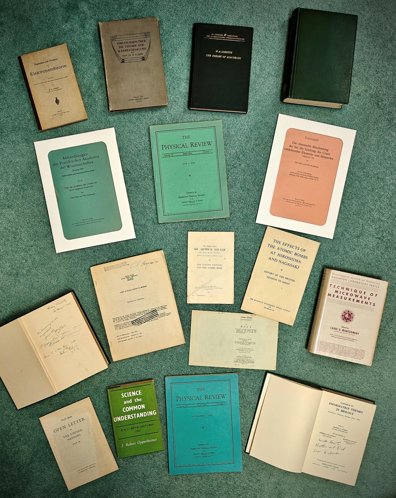

#### by Callum White

## The Project and Curatorial Vision

This collection began with a copy of J. Robert Oppenheimer’s Science and the Common Understanding. Oppenheimer’s conflicted voice, his attempt to reconcile science with conscience, stayed with me. From then on, I set out to trace the human stories of atomic scientists, not only as architects of history but also as individuals who later emerged from moral shadows, often seeking redemption through their “second acts”.

The collection now spans four phases: the innocent curiosity of pre-war inquiry; the dramatic turning point of fission’s discovery; the wartime shift to engineering and regulation; and finally, the divergent paths taken by scientists in the aftermath of Hiroshima and Nagasaki. Each item has been chosen not only for its intellectual significance but also for its human fingerprint, inscriptions, and provenance, which connect us to the lived experiences of those who shaped and were shaped by the atomic age. From Hahn and Strassmann’s original fission papers to one of my favourite items bearing Hubert Yockey’s tender inscription “with love to mother and dad,” these works speak in dialogue with one another, telling a story greater than the sum of their parts.

I hope that this collection will not only preserve the voices of atomic scientists but also invite reflection on the enduring dialogue between science and society.

## Awards and Recognition

- [The 2025 ABA National Book Collecting Prize](https://ilab.org/article/callum-white-wins-the-aba-national-book-collecting-prize-2025)
- Saatchi Gallery, [FIRSTS: LONDON’S RARE BOOK FAIR](https://www.saatchigallery.com/exhibition/firsts_londons_rare_book_fair)
  

## The Collection at a Glance

## Contacts

- Instagram: [@PaperParadigms](https://www.instagram.com/paperparadigms?igsh=MWFrMHJkOG41bHUyZw%3D%3D)
